Gallery 
========

.. contents:: Gallery Contents
    :local:

Line plots
----------

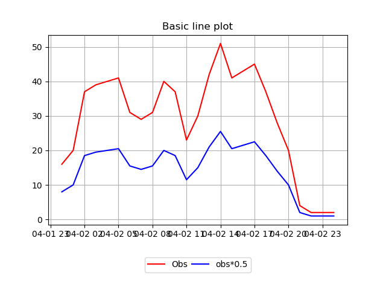

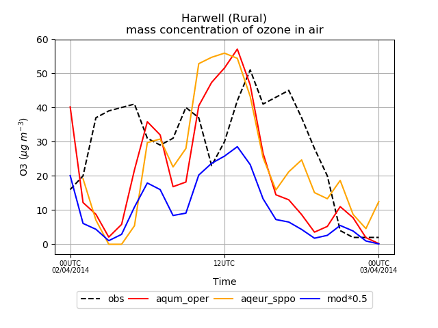
  
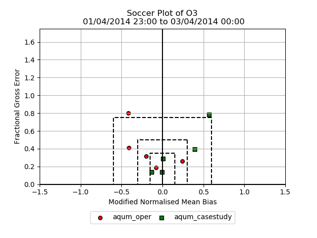
        
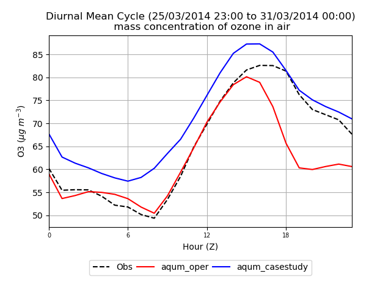
    
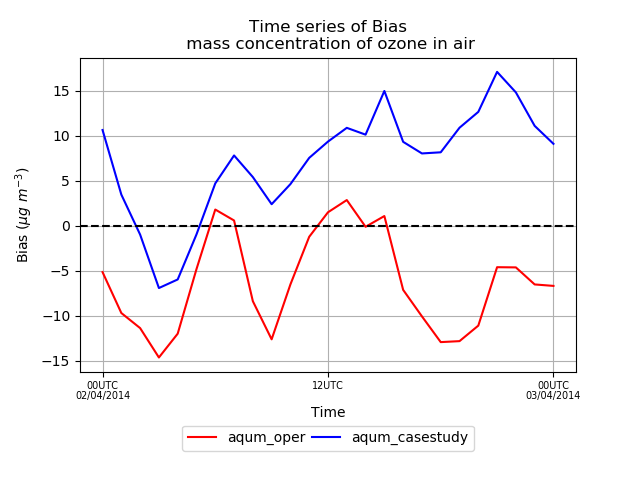

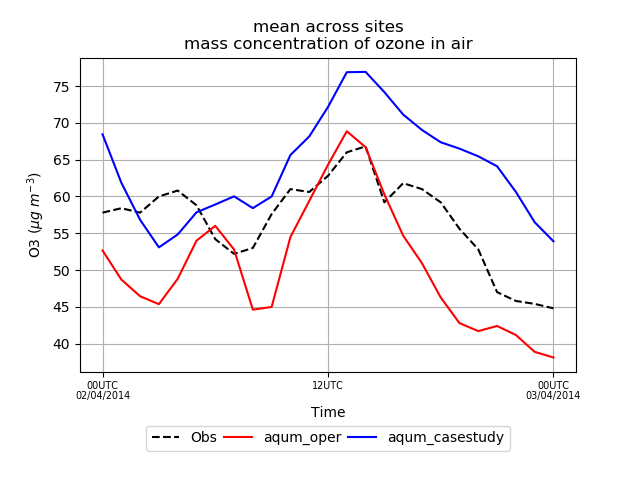
    
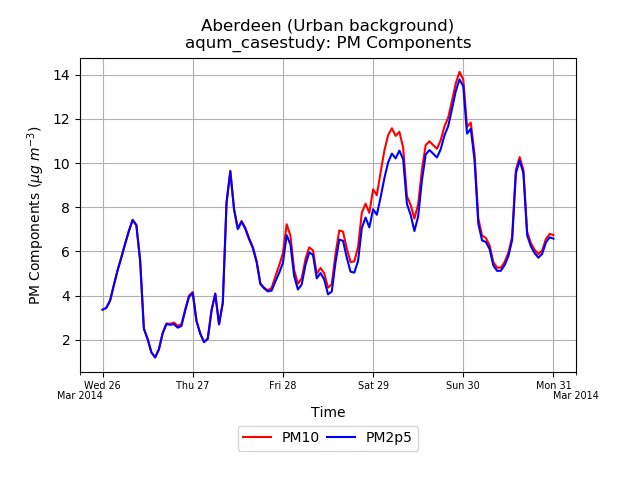

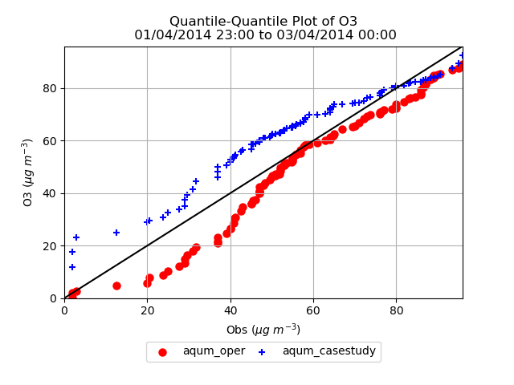

+---------------------------------------------------------------------------------------------------+----------------------------------------------------------------------------------------------------------------------+
| |Lineplot|                                                                                        | |timeseries|                                                                                                         |
+---------------------------------------------------------------------------------------------------+----------------------------------------------------------------------------------------------------------------------+
| Example basic line plot - see :class:`line_plot.LinePlot`                                         | Example time-series - see :class:`timeseries_plot.TimeSeriesPlot`                                                    |
+---------------------------------------------------------------------------------------------------+----------------------------------------------------------------------------------------------------------------------+
| |Soccer|                                                                                          | |Diurnal|                                                                                                            |
+---------------------------------------------------------------------------------------------------+----------------------------------------------------------------------------------------------------------------------+
| Example soccer plot - see :class:`statistics_plotting.SoccerPlot`                                 | Example diurnal plot - see :func:`adaq_plotting.plot_diurnal`                                                        |
+---------------------------------------------------------------------------------------------------+----------------------------------------------------------------------------------------------------------------------+
| |timeseries_stats|                                                                                | |site_mean_timeseries|                                                                                               |
+---------------------------------------------------------------------------------------------------+----------------------------------------------------------------------------------------------------------------------+
| Example timeseries of statistics - see :func:`adaq_plotting.plot_timeseries_of_stats`             | Example of mean timeseries across all sites - see :func:`adaq_plotting.plot_timeseries_aggregate_stats`              |
+---------------------------------------------------------------------------------------------------+----------------------------------------------------------------------------------------------------------------------+
| |QQ|                                                                                              | |multi_species_timeseries|                                                                                           |
+---------------------------------------------------------------------------------------------------+----------------------------------------------------------------------------------------------------------------------+
| Example quantile-quantile plot - see :class:`statistics_plotting.QQPlot`                          | multiple species on same timeseries plot - see :func:`adaq_plotting.plot_tseries_multiple_snames`                    |
+---------------------------------------------------------------------------------------------------+----------------------------------------------------------------------------------------------------------------------+

Field plots
-----------

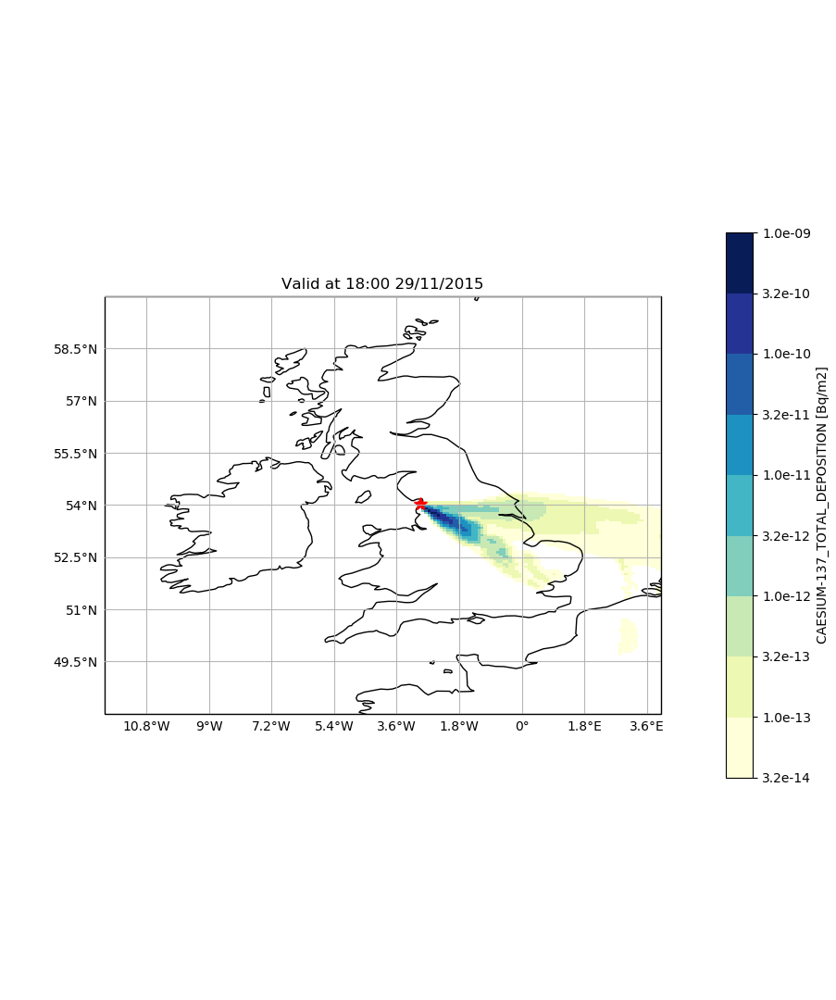
    
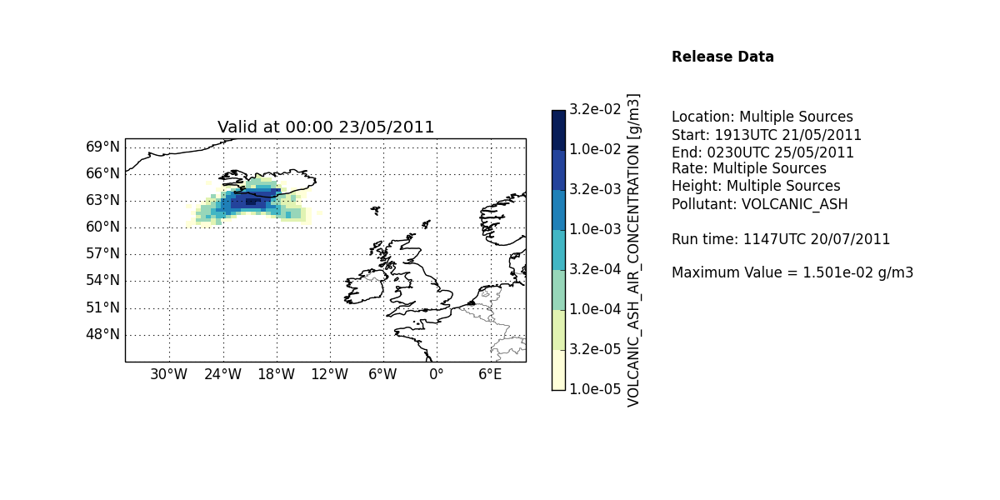
    
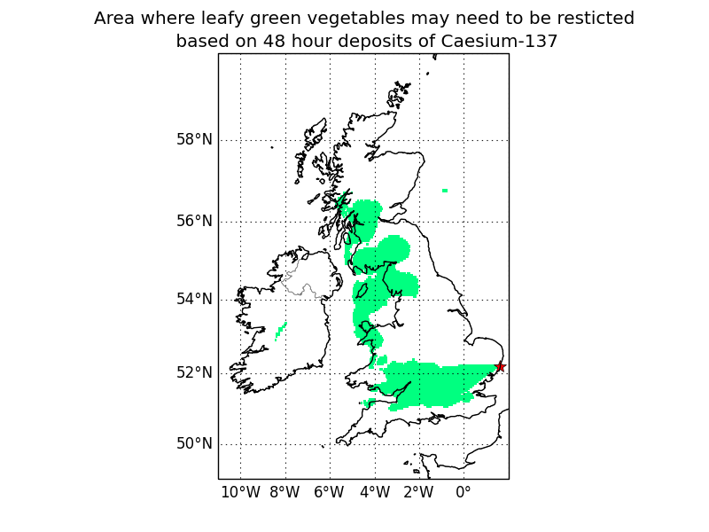
    
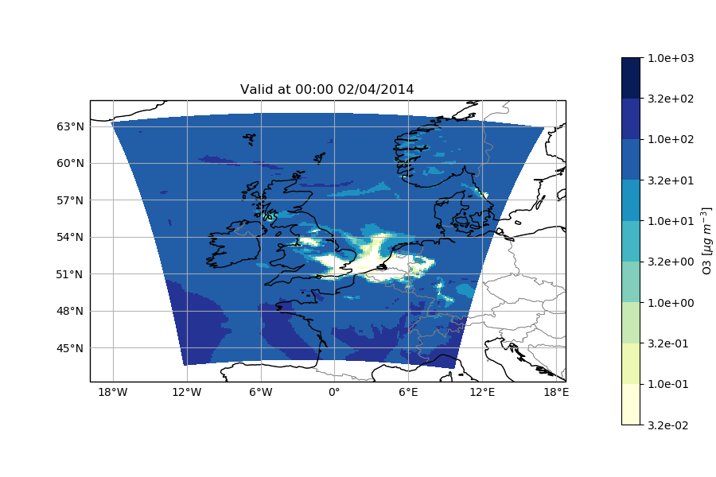
    
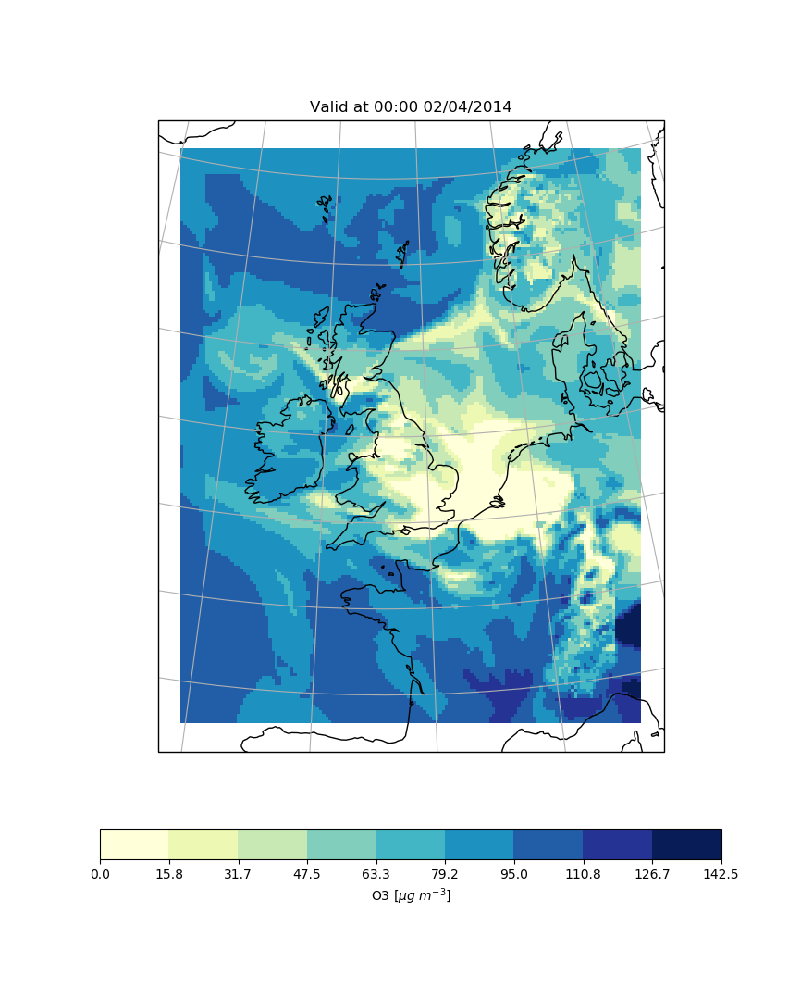
    
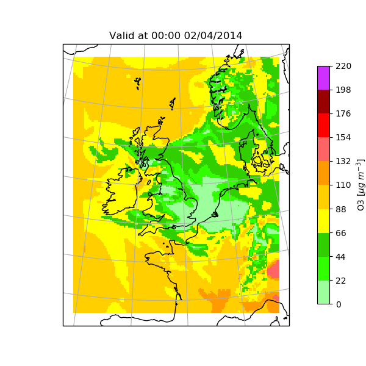
    
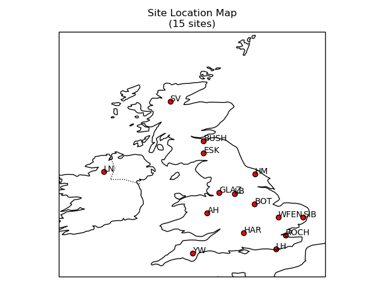
    
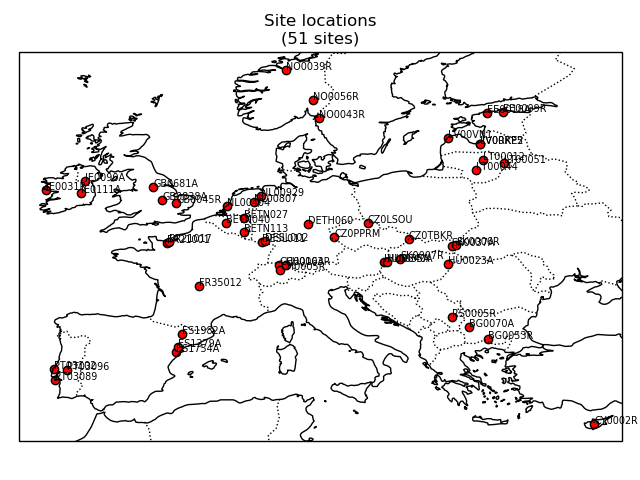
    
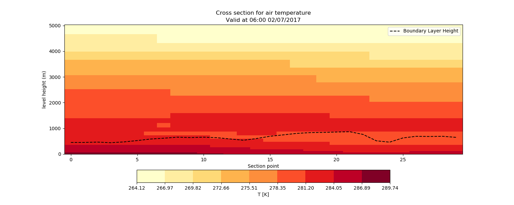
    
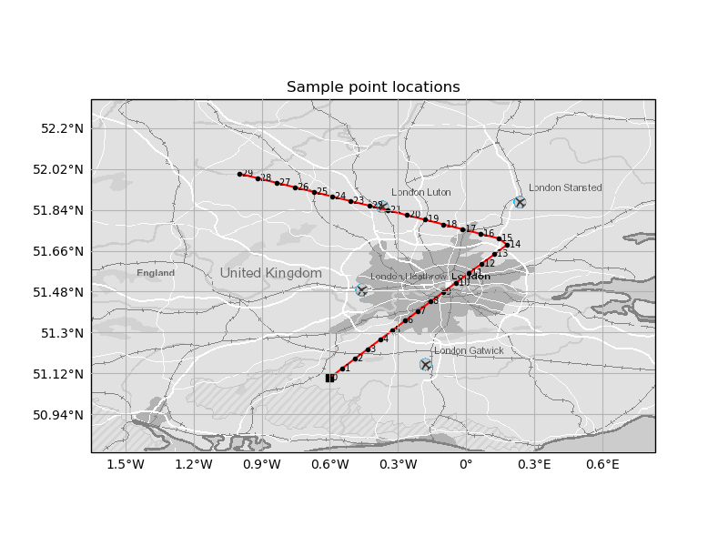

+--------------------------------------------------------------------------------------------------------+----------------------------------------------------------------------------------------------------------------------+
| |Cs137_total_dep|                                                                                      | |VA_concen|                                                                                                          |
+--------------------------------------------------------------------------------------------------------+----------------------------------------------------------------------------------------------------------------------+
| Example field plot - see :class:`field_plot.FieldPlot`                                                 | Example field plot with annotation - see :class:`field_plot.FieldPlot`                                               |
+--------------------------------------------------------------------------------------------------------+----------------------------------------------------------------------------------------------------------------------+
| |veg_plot|                                                                                             | |o3_basic_NAME|                                                                                                      |
+--------------------------------------------------------------------------------------------------------+----------------------------------------------------------------------------------------------------------------------+
| Example veg plot see :class:`field_plot.FieldPlot`                                                     | Example field plot from :func:`adaq_plotting.plot_md_gridded_fields` using defaults='NAME' option.                   |
+--------------------------------------------------------------------------------------------------------+----------------------------------------------------------------------------------------------------------------------+
| |o3_basic_aq|                                                                                          | |o3_full_aq|                                                                                                         |
+--------------------------------------------------------------------------------------------------------+----------------------------------------------------------------------------------------------------------------------+
| Example field plot from :func:`adaq_plotting.plot_md_gridded_fields` using defaults='AQ' option.       | Example field plot from :func:`adaq_plotting.plot_md_gridded_fields` using defaults='AQ' option with extra settings. |
+--------------------------------------------------------------------------------------------------------+----------------------------------------------------------------------------------------------------------------------+
| |site_locs|                                                                                            | |lim_site_locs|                                                                                                      |
+--------------------------------------------------------------------------------------------------------+----------------------------------------------------------------------------------------------------------------------+
| Map of site locations from SitesInfo class - see :func:`sites_info.SitesInfo.plot_location_map`        | Map of site locations limited to 3 per country from CAMSAQObsData class - see :func:`camsaqobs_data.limit_sites`     |
+--------------------------------------------------------------------------------------------------------+----------------------------------------------------------------------------------------------------------------------+
| |cross_section|                                                                                        | |cross_section_waypoints|                                                                                            |
+--------------------------------------------------------------------------------------------------------+----------------------------------------------------------------------------------------------------------------------+
| Example cross section along given waypoints - see                                                      | Location of waypoints used in cross section - see :func:`adaq_vertical_plotting.plot_md_cross_section`               |
| :func:`adaq_vertical_plotting.plot_cube_cross_section`                                                 | or :func:`adaq_vertical_plotting.plot_section_sample_locations`                                                      |
| or :func:`adaq_vertical_plotting.plot_md_cross_section`                                                |                                                                                                                      |
+--------------------------------------------------------------------------------------------------------+----------------------------------------------------------------------------------------------------------------------+

RSMC plots
^^^^^^^^^^

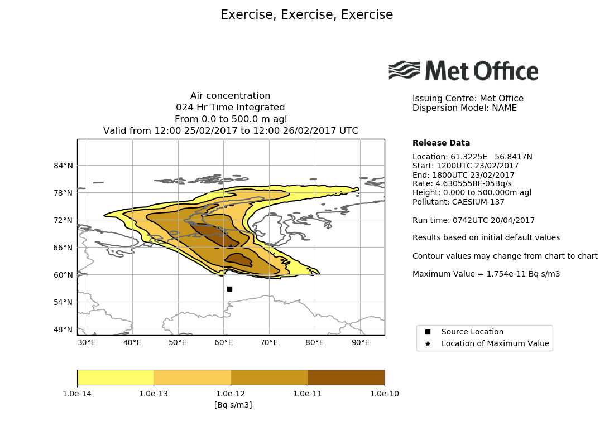

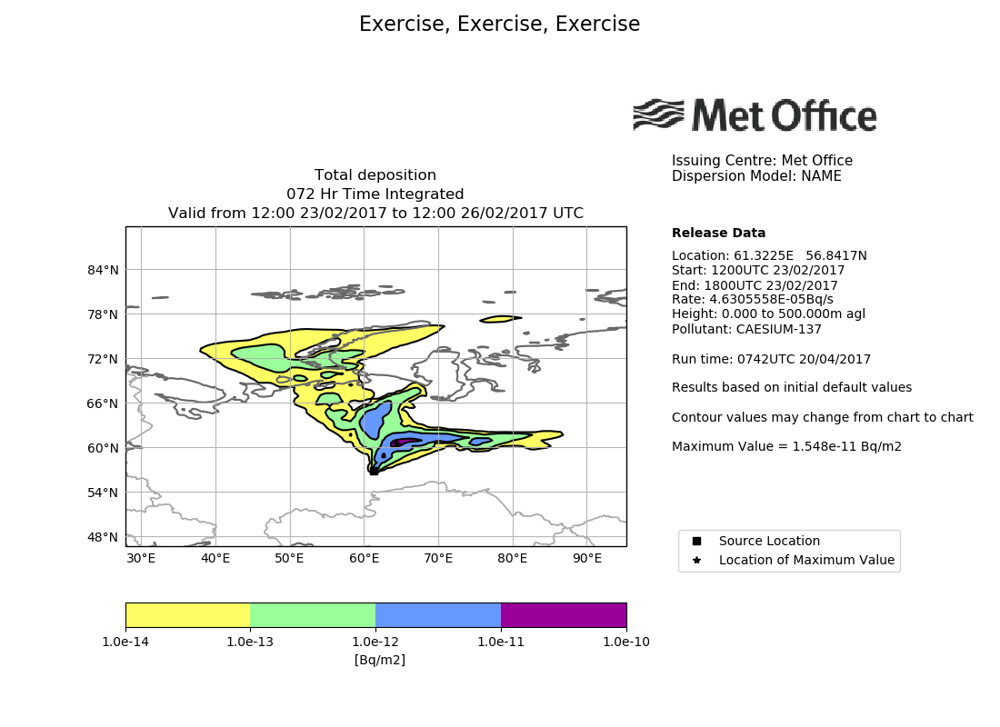

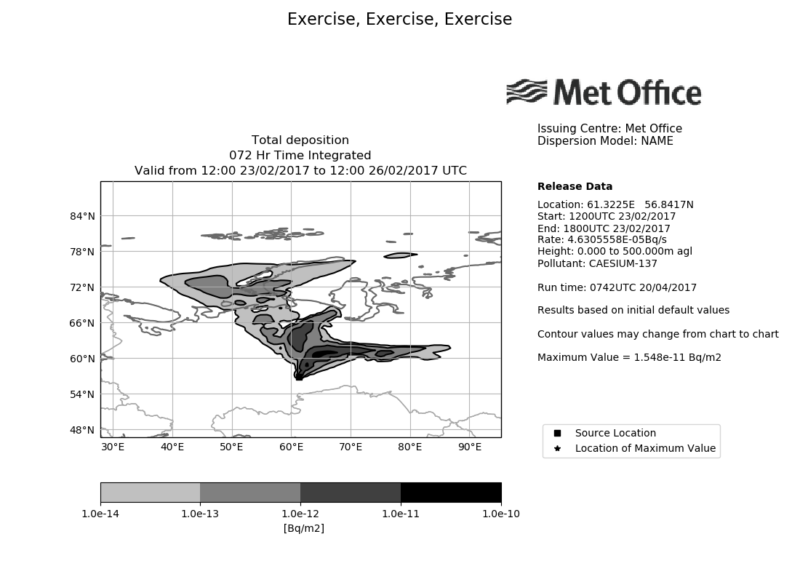

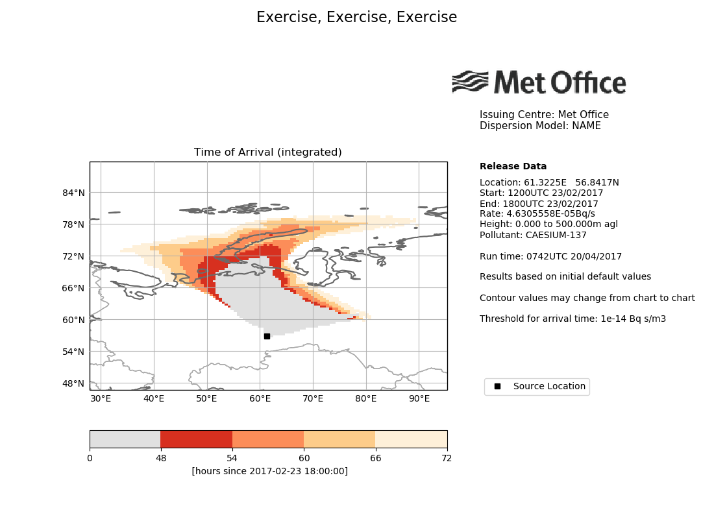

+------------------------------------------+-----------------------------------+
| |rsmc_air_conc|                          | |rsmc_dep|                        |
|                                          |                                   |  
| RSMC color air concentration plot        | RSMC color deposition plot        |
| see :mod:`rsmc_plot`                     | see :mod:`rsmc_plot`              |
+------------------------------------------+-----------------------------------+
| |rsmc_grey|                              | |rsmc_toa|                        |
|                                          |                                   |
| RSMC greyscale deposition plot           | RSMC time of arrival plot         |
| see :mod:`rsmc_plot`                     | see :mod:`rsmc_plot`              |
+------------------------------------------+-----------------------------------+

Ensemble Plots
^^^^^^^^^^^^^^

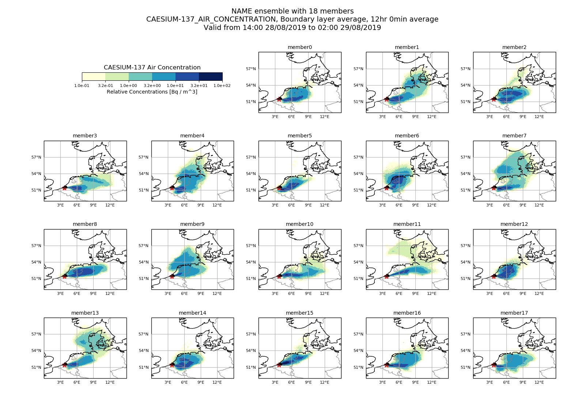
    
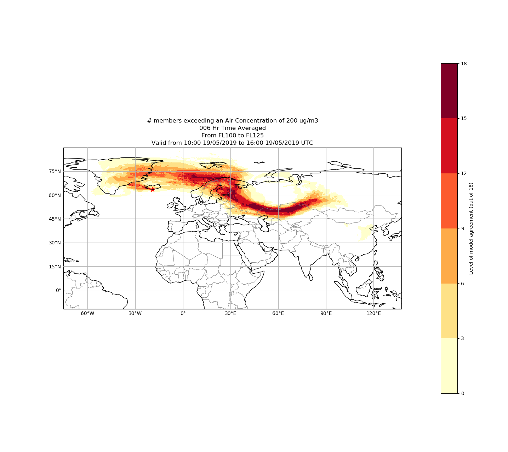

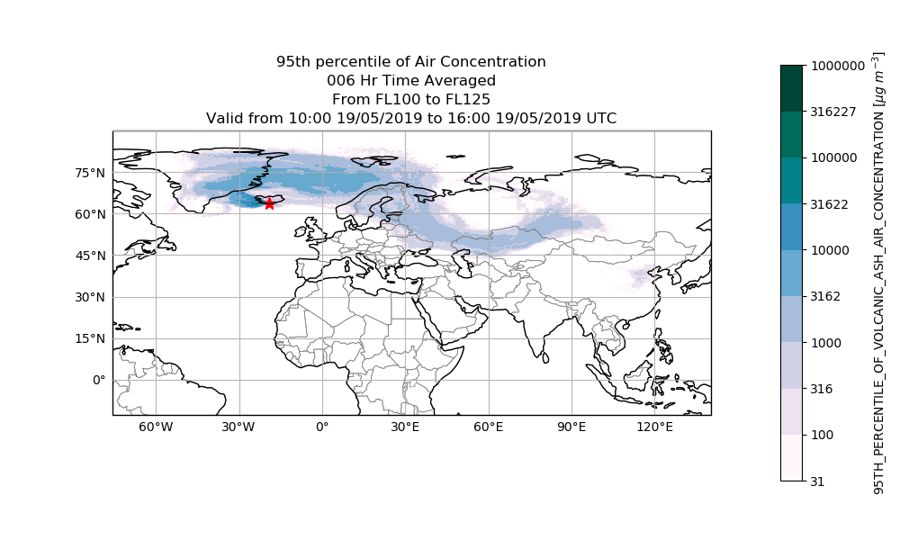

+---------------------------------------------------------------------+------------------------------------------------------------+
| |postage_stamp_air_conc|                                            | |ens_exceedance_plot|                                      |
+---------------------------------------------------------------------+------------------------------------------------------------+
| Example postage stamp plot - see :mod:`name_postage_stamp_plot`     | Example exceedance plot - see :mod:`ens_exceedance_plot`   |
+---------------------------------------------------------------------+------------------------------------------------------------+
| |ens_percentile_plot|                                               |                                                            |
+---------------------------------------------------------------------+------------------------------------------------------------+
| Example percentile plot - see :class:`ens_percentile_plot`          |                                                            |
+---------------------------------------------------------------------+------------------------------------------------------------+

Trajectory Plots
----------------

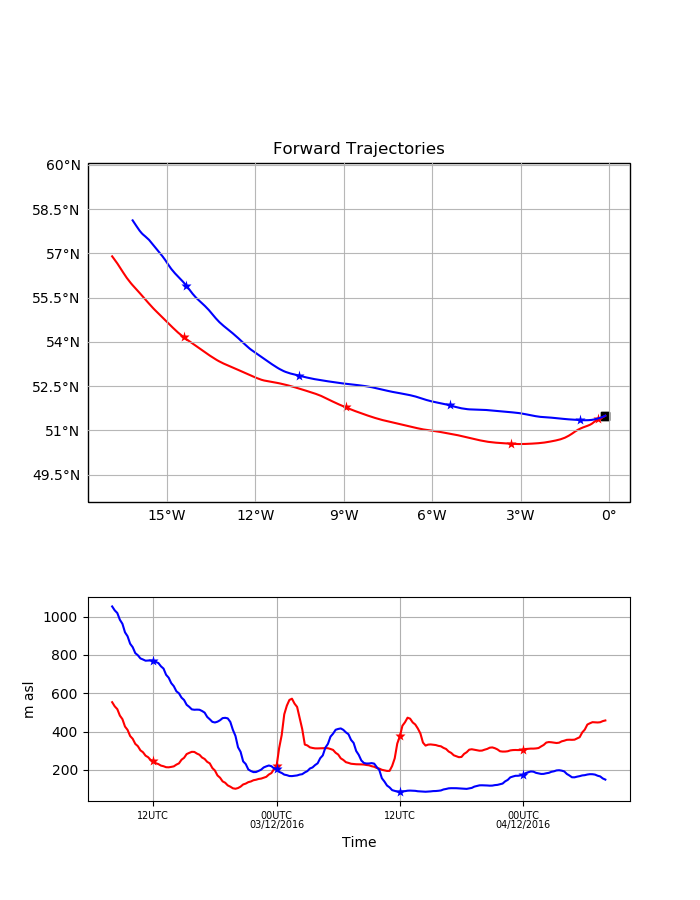

+----------------------------+
| |TrajectoryPlot|           |
+----------------------------+
| Forward Trajectory Plot    |
+----------------------------+

Comparison Plots
----------------

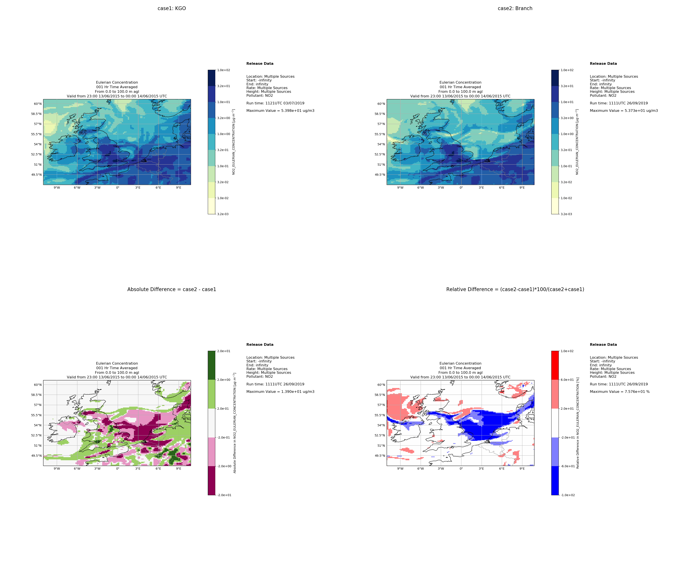

+---------------------------------------------------------------------+
| |Montage|                                                           |
+---------------------------------------------------------------------+
| Example Montage plot - see :class:`name_field_plot_diff`            |
+---------------------------------------------------------------------+

Colour Maps
-----------

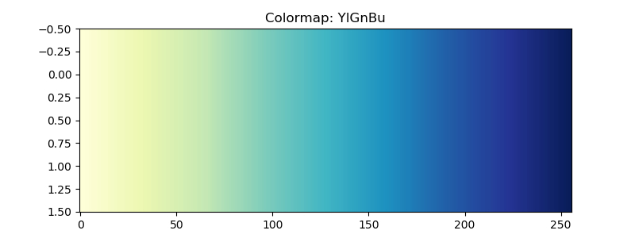
        
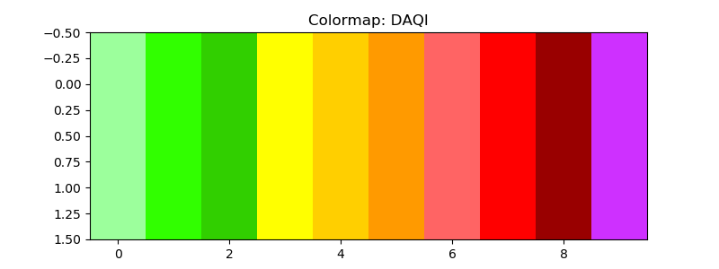
    
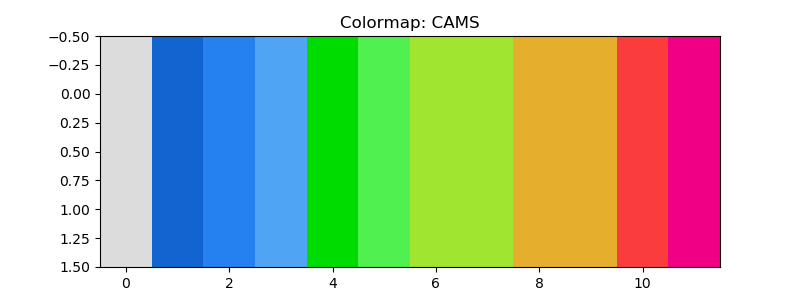

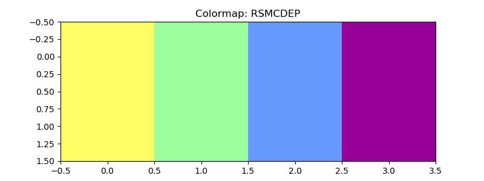

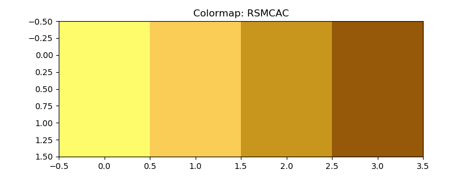

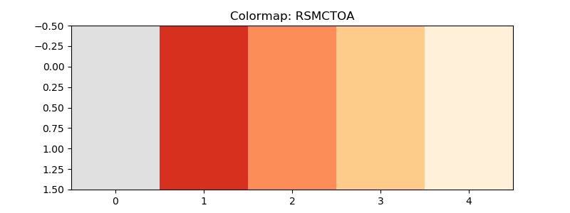

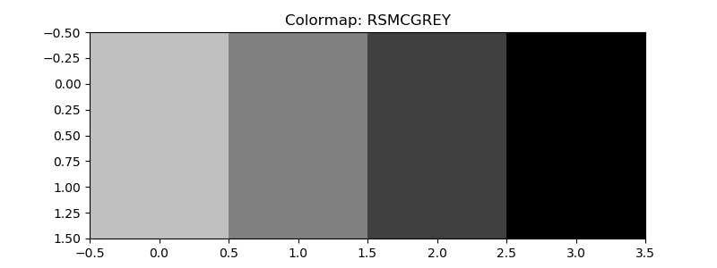
    
+------------------------------------------+-----------------------------------+----------------------------------+
| |YlGnBu|                                 | |daqi|                            | |cams|                           |
|                                          |                                   |                                  |  
| colormap 'YlGnBu' -                      | DAQI colormap -                   | CAMS colormap -                  |
| see :func:`plotting_functions.plot_cmap` | see :func:`aq_indices.daqi_cmap`  | see :func:`aq_indices.cams_cmap` |
+------------------------------------------+-----------------------------------+----------------------------------+
| |rsmcdep|                                | |rsmcac|                          |                                  |
|                                          |                                   |                                  |
| RSMC deposition colormap                 | RSMC air concentration colormap   |                                  |
| to match RSMC Toulouse -                 | to match RSMC Toulouse -          |                                  |
| see :func:`adaq_cmap.rsmcdep_cmap`       | see :func:`adaq_cmap.rsmcac_cmap` |                                  |
+------------------------------------------+-----------------------------------+----------------------------------+
| |rsmctoa|                                | |rsmcgrey|                        |                                  |
|                                          |                                   |                                  |
| RSMC time of arrival colormap -          | RSMC grey colormap for faxing -   |                                  |
| see :func:`adaq_cmap.rsmcdep_cmap`       | see :func:`adaq_cmap.rsmcac_cmap` |                                  |
+------------------------------------------+-----------------------------------+----------------------------------+

Histogram
---------

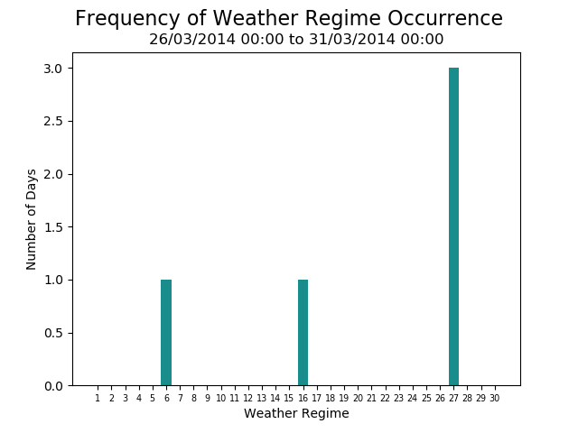
    
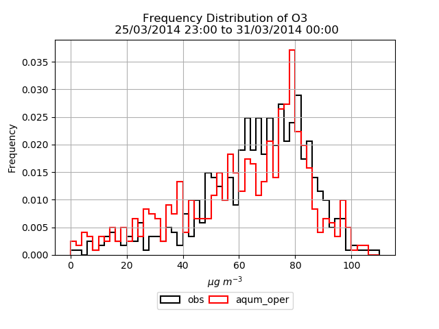

+------------------------------------------------------------------------------------------+---------------------------------------------------------------------------------------------------+
| |Regime_bar|                                                                             | |Hist|                                                                                            |
+------------------------------------------------------------------------------------------+---------------------------------------------------------------------------------------------------+
| Weather regime bar chart - see :func:`weather_regime.plot_regime_bar`                    | Example histogram plot - see :class:`statistics_plotting.Histogram`                               |
+------------------------------------------------------------------------------------------+---------------------------------------------------------------------------------------------------+

Sandpit
-------

Tephi Plots
^^^^^^^^^^^

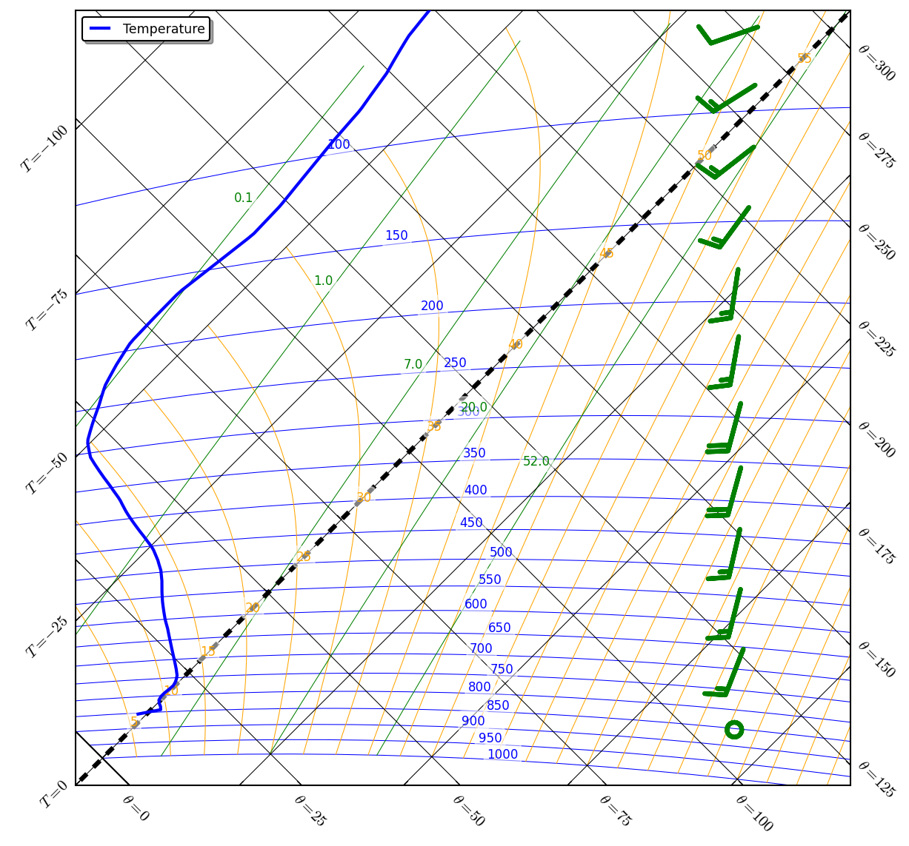

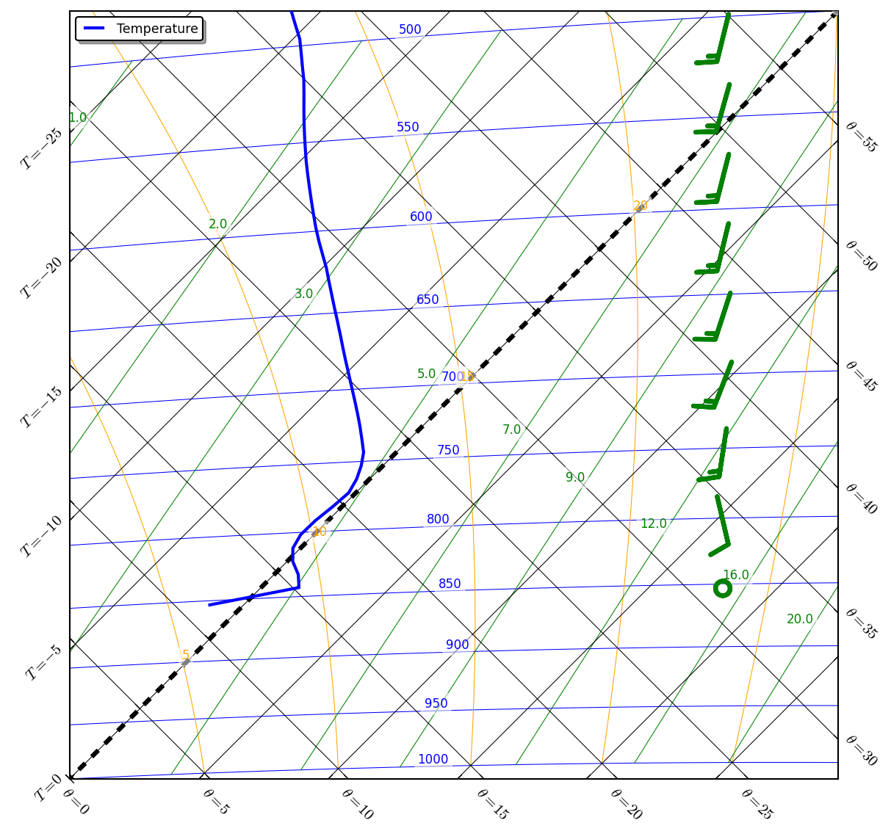

+------------------------------------------------------------------------------------------+---------------------------------------------------------------------+
| |Tephi_full|                                                                             | |Tephi_focus|                                                       | 
+------------------------------------------------------------------------------------------+---------------------------------------------------------------------+
| Example full tephigram - see :mod:`tephibarbs`                                           | Example zoomed tephigram - see :mod:`tephibarbs`                    |
+------------------------------------------------------------------------------------------+---------------------------------------------------------------------+

Trajectory Plots
^^^^^^^^^^^^^^^^

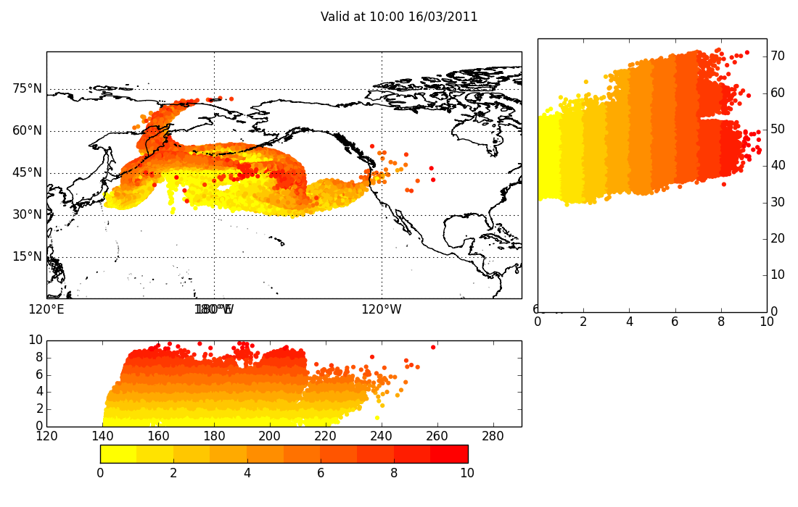

+---------------------------------------------------------------------+
| |trajplume|                                                         |
+---------------------------------------------------------------------+
|  Example of trajectory plume plotting - see :mod:`trajectory_plume` |
+---------------------------------------------------------------------+

Ensemble Plots
^^^^^^^^^^^^^^^^

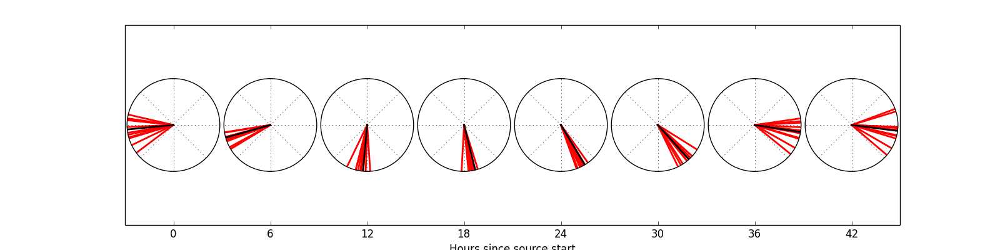
   
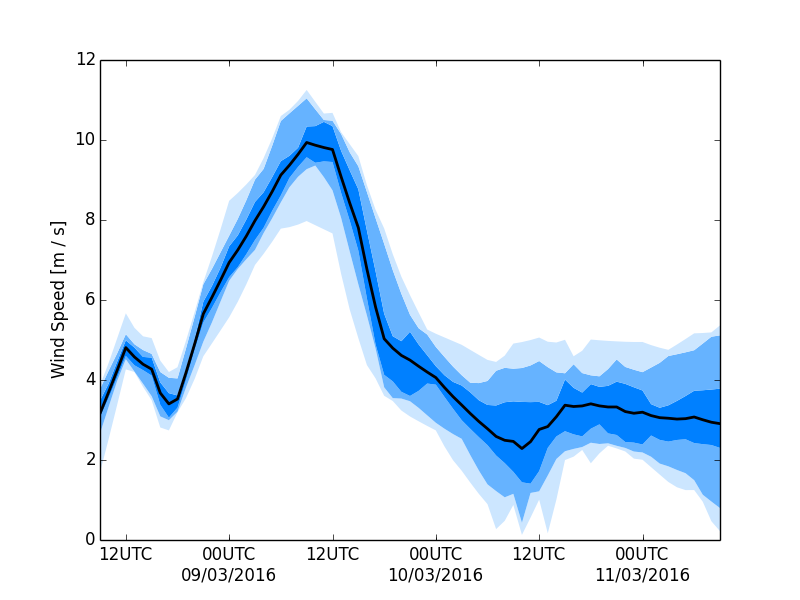

+------------------------------------------------------------------------------------------+---------------------------------------------------------------------+
| |met_plume|                                                                              | |wind_metogram|                                                     |
+------------------------------------------------------------------------------------------+---------------------------------------------------------------------+
| wind speed ensemble met plume - see :mod:`ensemble_met_plume`                            | wind direction metogram - see :mod:`wind_direction_metogram`        |
+------------------------------------------------------------------------------------------+---------------------------------------------------------------------+

Other
^^^^^

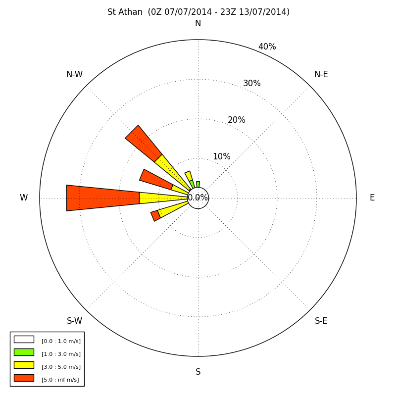

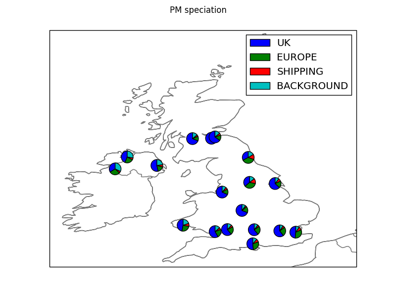

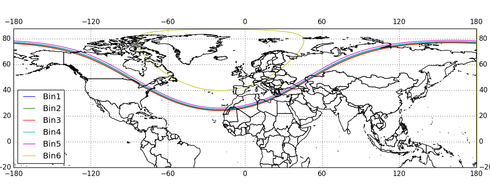

.. |check_domain| image:: figures/check_domain_thetagrid.png
    :width: 400px

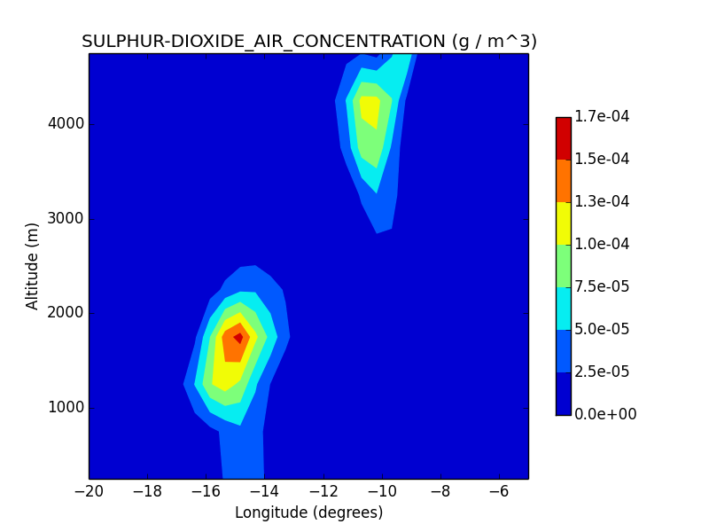

+------------------------------------------------------------------------------------------+---------------------------------------------------------------------+
| |windrose|                                                                               | |pie_map|                                                           |
+------------------------------------------------------------------------------------------+---------------------------------------------------------------------+
| Example windrose - see :mod:`windrose_plot`                                              | Example of pie charts plotted on a map - see :mod:`plot_pie_map`    |
+------------------------------------------------------------------------------------------+---------------------------------------------------------------------+
| |rings|                                                                                  | |check_domain|                                                      |
+------------------------------------------------------------------------------------------+---------------------------------------------------------------------+
| Example of distance rings - see :mod:`Rings`                                             | Example of domain checking - see :mod:`check_domain`                |
+------------------------------------------------------------------------------------------+---------------------------------------------------------------------+
| |cross_sec|                                                                              |                                                                     |
+------------------------------------------------------------------------------------------+---------------------------------------------------------------------+
| Plume cross section - see :mod:`plume_cross_section_plot`                                |                                                                     |
+------------------------------------------------------------------------------------------+---------------------------------------------------------------------+
