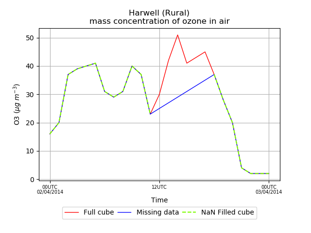

Comparing model and observations
================================

There are various routines available for comparing a model (or multiple models,
or multiple runs of the same model) to a set of observations.
These are generally designed to work from inifiles
and on site-specific (sites_cube_list) data. This section will introduce some
of these key routines and describe how you might go about doing model
comparisons.

We begin by ensuring the adaqcode is imported. This is important both for
automated testing of this user guide page, but also if you want to follow
this page yourself.

>>> import sys
>>> adaq_path = '../../' #Full address of checked out code
>>> sys.path.append(adaq_path)
>>> import adaqcode

How to load the data in using inifiles is described in
:ref:`loading_using_inifiles`. For this however we will work with the example
data:

>>> ini_dict, sites_data, od, md_list = adaqcode.adaq_functions.get_exampledata() # doctest: +ELLIPSIS
Reading inifile .../adaqcode/example_data_1days.ini
Number of sites:  5

Note in general we have a single observation type, but a list of models
(or model runs). Most of the following routines expect this:

>>> print(od) # doctest: +ELLIPSIS
<class '...adaq_data.ADAQData'> - Subclass of ADAQData - Contains:
sites_cube_list:
0: mass_concentration_of_ozone_in_air / (ug/m3) (site_id: 5; time: 25)
1: mass_concentration_of_pm2p5_ambient_aerosol_in_air / (ug/m3) (site_id: 5; time: 25)
gridded_cube_list:
< No cubes >
trajectory_cube_list:
< No cubes >

>>> print(md_list) # doctest: +ELLIPSIS
[<...adaq_data.ADAQData object at ...>, <...adaq_data.ADAQData object at ...>]

Preparing data
^^^^^^^^^^^^^^

Unit Conversion
---------------

Data are read in without any unit conversion from the raw format. In order to
compare model and observations they must be in the same units. A simple routine to do
the conversion to ug m-3 exists: :func:`adaq_functions.unit_conversion`:

>>> od, md_list = adaqcode.adaq_functions.unit_conversion(od, md_list, chem_units='ug/m3', aerosol_units='ug/m3')

Adding missing times
--------------------

If files are missing from some of the data, some times may be missed out
in the cubes, but which should really be set to missing (ie nan) data.
This is particularly important if plotting time-series as a line will be
drawn over this missing period connecting the two nearest points, rather
than leaving this section of the line blank.

>>> import iris
>>> cube = od.extract(site_name='Harwell', short_name='O3', singlecube=True)
>>> print(cube.summary(shorten=True))
mass_concentration_of_ozone_in_air / (ug/m3) (time: 25)
>>> #Remove a portion of the middle of the cube as example
>>> cube_missing = iris.cube.CubeList([cube[:12],cube[18:]]).concatenate_cube()
>>> print(cube_missing.summary(shorten=True))
mass_concentration_of_ozone_in_air / (ug/m3) (time: 19)

To correct for this error, use the routine
:func:`adaq_functions.add_missing_times`.
which adds nan values in the place of any missing times for all observations
and models. This routine should only be used if the data is expected to
have a regular sampling period (eg the data should be hourly).
(Note this is a wrapper around :func:`cube_time.cube_add_missing_times` which
takes a single cube).

>>> od, md_list = adaqcode.adaq_functions.add_missing_times(od, md_list)
Adding missing times

To see the impact on the single cube we had above:

>>> tsp = adaqcode.timeseries_plot.TimeSeriesPlot()
>>> tsp.add_line(cube, linestyle='-', linewidth=1, label='Full cube')
>>> tsp.add_line(cube_missing, linestyle='-', linewidth=1, label='Missing data')
>>> cube_filled = adaqcode.cube_time.cube_add_missing_times(cube_missing)
>>> tsp.add_line(cube_filled, colour='lawngreen',
... linestyle='--',label='NaN Filled cube')

>>> fig = tsp.plot()
>>> tsp.save_fig(plotdir=adaqcode.CODE_DIR+'/adaqdocs/figures/user_guide/',
...              filename='tsp_missing_data.png') # doctest: +ELLIPSIS
Saved figure  .../tsp_missing_data.png

Matching data for statistics
----------------------------

In order to allow fair calculation of statistics between two (or more)
different datasets, all sets of data should have data at the same times/points.
In particular, this means that if for any point one dataset has nan data,
this point should not be included in calculations of statistics for other
datasets. For example, if observations are missing for a day, then when
calculating a mean value of the data, this day should also been ignored in
the model datasets. (Alternatively there might not be any observations for
a particular species at a site, but model data is available). Another
possiblity is that the datasets have overlapping times - for example
observations are available for Monday and Tuesday, but the model data
is only available for the Tuesday.

In practice this means setting these times / sites to nan in all datasets.

To do this easily, use the routine :func:`adaq_functions.match_data_for_stats`
which works with od and md_list. (Note this is a wrapper around
:func:`cube_statistics.match_cubes` which takes a list of cubes).

>>> od_stats, md_stats_list = adaqcode.adaq_functions.match_data_for_stats(ini_dict, od, md_list)

Note it is best to keep the returned values in separate variables as you
may still want the original, unmatched data, for other routines (eg for
plotting time-series).

Statistics
^^^^^^^^^^

Basic statistics
----------------

Once we have matched our data fairly, then we can start to calculate statistics.
Let us initially consider a single short_name, O3,
and compare just one model to observations.

>>> o3_obs = od_stats.extract(short_name='O3', singlecube=True)
>>> o3_mod = md_stats_list[0].extract(short_name='O3', singlecube=True)

The :class:`timeseries_stats.TimeSeriesStats` class can be used to calculate statistics comparing two
datasets (eg model v observations).

Initialise class using observation and model cubes:

>>> stats = adaqcode.timeseries_stats.TimeSeriesStats(o3_obs, o3_mod)

Individual statistics can then be calculated, eg:

>>> rmse = stats.rmse()
>>> print('{:.3f}'.format(rmse))
20.180

Or a full dictionary of basic statistics can be calculated at once:

>>> statsdict = stats.get_basic_stats()
>>> print(sorted(statsdict.keys())) # doctest: +NORMALIZE_WHITESPACE
['bias', 'correlation', 'fac2', 'falsealarmrate', 'falsealarmratio', 'fge',
'hitrate', 'ioa', 'maxmod', 'maxobs', 'mdi', 'meanmod', 'meanobs', 'mge',
'mnmb', 'nmb', 'nmge', 'npts', 'nsites', 'o<t_m<t', 'o<t_m>=t', 'o>=t_m<t',
'o>=t_m>=t', 'odds_ratio', 'orss', 'pc95mod', 'pc95obs', 'perc_correct',
'perc_over', 'perc_under', 'rmse', 'sdmod', 'sdobs', 'threshold', 'units']
>>> print('{:.3f}'.format(statsdict['bias']))
-6.204

If these are required to be output to a file, the easiest way to do this is to
use :func:`timesseries_stats.save_stats`:

>>> adaqcode.timeseries_stats.save_stats([stats], filename_prefix='statistics',
... directory=adaqcode.CODE_DIR+'/adaqdocs/figures/user_guide/',
... format_list=['csv', 'wiki']) # doctest: +SKIP

Full observation v model statistics
-----------------------------------

To output statistics for all models compared to a single observation
dataset, for all short names, this can be done very simply using
:func:`adaq_functions.calc_stats`:

>>> ini_dict['plot_dir'] = adaqcode.CODE_DIR+'/adaqdocs/figures/user_guide/'
>>> ini_dict['calc_stats_format_list'] = ['csv']
>>> tsstats_list = adaqcode.adaq_functions.calc_stats(ini_dict, od, md_list)
... # doctest: +ELLIPSIS
Statistics saved to .../user_guide/stats.csv

Note that the statistics output file can be obtained in different file formats
(csv, wiki, html, tex) by adding the file extension to the inifile key
'calc_stats_format_list'.

Have a quick look at the first few lines of a file produced using this routine -
you can see that all the statisitcs have been output, for all the models:

>>> statsfile = ini_dict['plot_dir'] + 'stats.csv'
>>> with open(statsfile,"r") as fin:
...     for iline, line in enumerate(fin):
...         print(line.strip())
...         if iline > 10: break
Statistics for Tue 01-Apr-2014 23:00 - Thu 03-Apr-2014 00:00,,,
Phenomemon,           Statistic,aqum_oper,aqum_casestudy
<BLANKLINE>
O3,              nsites,         5,         5
O3,                npts,       125,       125
O3,         correlation,      0.64,      0.55
O3,        bias (ug/m3),     -6.20,      7.13
O3,                 nmb,     -0.11,      0.13
O3,                mnmb,     -0.17,      0.17
O3,                nmge,      0.30,      0.30
O3,                 fge,      0.39,      0.35
O3,        rmse (ug/m3),     20.18,     20.10

.. _plotting_model_obs_ref:

Plotting model v observations
^^^^^^^^^^^^^^^^^^^^^^^^^^^^^

There are various routines available to allow easy plotting of od (observations
object) compared to md_list (list of model data objects). These are generally
included in :mod:`adaq_plotting`. These include time-series plotting, gridded
plotting (:func:`adaq_plotting.plot_md_gridded_fields`) and various statistical
plots - have a play with various routines yourself! These usually rely on the
output plot directory being given via a .ini file so are set in ini_dict, eg:

>>> ini_dict['plot_dir'] = adaqcode.CODE_DIR+'/adaqdocs/figures/user_guide/'

For example to produce histogram plots for a particular short-name, using
a single line of code instead of going through all the individual steps
given in :ref:`user_guide_plothist`, you can use
:func:`adaq_plotting.plot_histogram`:

>>> dp = adaqcode.adaq_plotting.plot_histogram(ini_dict, od, md_list, 'PM2p5') # doctest: +ELLIPSIS
Plotting histogram
Saved figure  .../Histogram_PM2p5.png

    .. image:: ../figures/user_guide/Histogram_PM2p5.png
       :scale: 75%

(Note this is only one day of data hence the histogram is not particularly pretty!)

.. Note to developers. If you change any of the questions below then you will
   also need to change the answers in answers.rst

.. _comparing_questions_ref:

Comparing Model and Obs Exercises
^^^^^^^^^^^^^^^^^^^^^^^^^^^^^^^^^

  1. Using the example data extract the data with short_name *PM2p5* at Aberdeen
     compute the bias and the correlation.

    a. Load the example data
    b. Run *match_data_for_stats* to ensure that the data has the same
       points/times
    c. Extract the observations for PM2p5 at Aberdeen
    d. Extract some model data for PM2p5 at Aberdeen
    e. Initialise the statistics using the extracted observations and model data
    f. Compute and print the bias and the correlation

  2. Following the method shown in :ref:`plotting_model_obs_ref` reproduce the
     quantile-quantile plot you produced in Exercise 2 in
     :ref:`plottingsites_questions_ref`. (See :func:`adaq_plotting.plot_qq`)

     a. Load in the example data
     b. Change the location of the plotting directory 'plot_dir'
     c. Produce the quantile-quantile plot
        (Hint: the function is called plot_qq)

Answers to :ref:`comparing_answers_ref`

